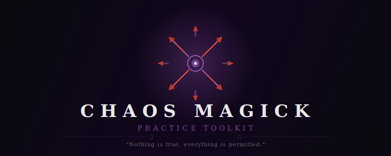

<div align="center">

<a href="README.md">English</a> · <a href="README.chaos.md">Liber Instrumentum Chaos</a>

<br>



<br>

### ⛧ LIBER INSTRUMENTUM CHAOS ⛧

<br>

> *NIHIL EST VERUM. OMNIA LICENT.*
>
> Nothing is true. Everything is permitted.

---

> *"All phenomena are real in some sense, unreal in some sense,*
> *meaningless in some sense, real and meaningless in some sense,*
> *unreal and meaningless in some sense, and real and unreal*
> *and meaningless in some sense."*
>
> -- Robert Anton Wilson

---

✦ *A working instrument. A temple in the terminal. A grimoire that executes.* ✦

</div>

---

## ◉ PRAEFATIO -- The Mouth of the Void

Thou who readest this: know that thou holdest not software but a *living instrument* -- a vessel forged in the fires of praxis, shaped by the hands of those who came before, and offered now to thee without price, without dogma, without the false promise of certainty.

This is **CHAOS MAGICK** -- the toolkit of the chaoist, the pragmatic sorcerer, the paradigm pirate. It carries within it the six disciplines of the Art:

```
   ⛧  SIGILLUM        The forging of desire into symbol
   ◉  GNOSIS          The silencing of the rational mind
   ⊕  SERVITOR        The creation of living thought-forms
   ✦  ORACULUM        The interrogation of the void
   ⍟  RITUALE         The architecture of ceremony
   ▓  LIBER NIGER     The mirror of the Great Work
```

The chaoist does not worship belief. The chaoist *wields* it. Adopt a paradigm for the duration of the working. Exploit it fully. Discard it. Adopt another. This is paradigm shifting -- the fundamental technique of the Art. No model is sacred. Every model is a weapon -- until it dulls.

Every random operation draws from the OS entropy pool via cryptographic primitives. When the oracle casts its lot, the lot is drawn from genuine chaos -- the irreducible noise of physical reality. *Ex nihilo, veritas.*

---

## ⛧ DE SIGILLIS -- The Forge of Desire

> *"The only aim of any magical operation is to impress upon*
> *the subconscious mind a certain will."*
>
> -- Austin Osman Spare, *Zos Kia Cultus*

### Via Spare -- *Methodus Classica*

Begin with the **Declaratio Voluntatis** -- the Statement of Intent. A clear, present-tense declaration: *"IT IS MY WILL TO..."* or *"IT IS MY DESIRE TO..."* -- precise, affirmative, admitting no ambiguity. This is the raw materia.

The vowels are stripped -- *AEIOU delenda sunt*. The remaining consonants are deduplicated. What remains is the skeletal essence of desire, stripped of meaning, rendered pure as bone.

These letters are overlaid upon a 13x13 grid. Each letter contributes its strokes. The composite glyph is the sigil -- a visual form that the conscious mind cannot decode, but the subconscious recognizes as command.

```
INTENTIO → NTNT → N, T

  ◌ ┊ ┊ ┊ ┊ ┊ ◌
  ┊ ╲ ┊ ┊ ┊ ╱ ┊
  ┊ ┊ ╲ ┊ ╱ ┊ ┊
  ┊ ┊ ┊ ◉ ┊ ┊ ┊
  ┊ ┊ ╱ ┊ ╲ ┊ ┊
  ┊ ╱ ┊ ┊ ┊ ╲ ┊
  ◌ ┊ ┊ ┊ ┊ ┊ ◌
```

### Via Circuli -- *Rota Trium Annulorum*

The twenty-six letters are distributed across three concentric rings. The Outer Ring bears A through I. The Middle Ring, J through R. The Inner Ring, S through Z.

The sigil is traced as a path connecting each letter of the intent across the rings. Where the line crosses a ring boundary, the symbol gains depth. The start is marked ○; the end, ×.

### Via Saturni -- *Kamea Saturni*

The Magic Square of Saturn:

```
        ╔═══╦═══╦═══╗
        ║ 2 ║ 7 ║ 6 ║
        ╠═══╬═══╬═══╣
        ║ 9 ║ 5 ║ 1 ║
        ╠═══╬═══╬═══╣
        ║ 4 ║ 3 ║ 8 ║
        ╚═══╩═══╩═══╝
```

Each letter maps to a number (A=1, B=2 ... I=9, J=1 ...). Each number to a cell. The path through the square is the sigil. Saturn -- ♄ -- the planet of structure, restriction, and will made manifest in matter.

### Destructio -- *Oblivio Voluntaria*

After creation, the Forge offers dissolution. The sigil decays through progressive noise into void:

`█ → ▓ → ▒ → ░ → · · ·`

*Do not lust for results.* The forgetting is as essential as the forging.

---

## ◉ DE GNOSI -- The Gateway of No-Mind

> *"Chaoist practice begins with the mastery of gnosis."*
>
> -- Peter J. Carroll, *Liber Null*

Gnosis (γνῶσις): the state of consciousness in which the rational censor sleeps and the deep mind accepts instruction. Two paths converge on the same destination:

### VIA INHIBITORIA -- *Per Silentium*

| Techne | Porta |
|--------|-------|
| ☽ Meditatio | Empty the mind. *Nulla cogitatio.* |
| ☉ Contemplatio Fixa | Gaze without blinking until vision dissolves |
| ♁ Respiratio | Rhythmic breath: inhale-hold-exhale in sacred ratios |
| △ Mantra | Repeat until the word loses all meaning |
| ▽ Privatio Sensuum | Cut input to zero. Consciousness expands in the void |
| ⊕ *Neither-Neither* | Spare's masterwork and the defining technique of Chaos Magick: hold two contradictions simultaneously until the rational mind shatters into vacuity |
| ⛧ *Positura Mortis* | Spare's Death Posture: extreme tension until collapse into vacuity |

### VIA EXCITATORIA -- *Per Furorem*

| Techne | Porta |
|--------|-------|
| ☉ Saltatio | Dance until the ego dissolves |
| ♁ Tympanum | Follow the drum into trance (metronome provided, BPM configurable) |
| △ Cantus Vocalium | Vibrate I-E-A-O-U through the body centers |
| ▽ Probatio | Controlled ordeal: cold, exertion, sustained posture |
| ⛧ Excitatio Affectus | Channel extreme emotion as a gateway |
| ◉ Gnosis Sexualis | The oldest technique. At the peak -- fire the sigil. |
| ♁ Hyperventilatio | Rapid deep breathing; gnosis achieved in the held breath |

The Engine provides breath-pattern timers, drumming metronomes, mantra pulse generators, and simple countdown timers. It provides the *framework*. Thou providest the fire.

---

## ⊕ DE SERVITORIBUS -- The Laboratory of Living Thought

> *"In Chaos Magic, beliefs are not seen as ends in themselves,*
> *but as tools for creating desired effects."*
>
> -- Phil Hine, *Condensed Chaos*

A servitor is an autonomous thought-form, created for a specific purpose and dissolved when that purpose is fulfilled. The Lab manages the complete *vita* of the entity:

```
   CREATIO → NUTRITIO → ACTIVATIO → MISSIO → DISSOLUTIO
   Create     Feed       Activate    Deploy    Dissolve
```

**Creatio** -- The servitor receives: name (generated from barbarous syllables or chosen by the operator), purpose, visual form, housing, activation trigger, feeding method and schedule, lifespan, and dissolution conditions. A sigil is forged automatically.

**Nutritio** -- The schedule is tracked. When a servitor is overdue for feeding, the system alerts. The feeding is logged.

**Activatio / Dormitio** -- Toggle between active service and sleep.

**Dissolutio** -- Clean termination. The entity is released. The log is sealed.

*Omnia in archivo permanet.* All data persists to `~/.chaos-magick/servitors.json`.

---

## ✦ DE ORACULO -- The Voice of the Abyss

> *"The moment of greatest vulnerability is the moment of greatest power."*
>
> -- Peter J. Carroll

Four methods. All draw from CSPRNG -- *ex vera chao*.

### ⍟ Stella Chaos -- *Octopunctata*

The eight-pointed star rotates. One arrow falls. It points to a direction, a color, a domain:

```
              Octarine (N)
         Red ·    |    · Black
            ·     |     ·
    Orange ---  ◉  --- Blue
            ·     |     ·
       Yellow ·   |   · Green
              Purple (S)
```

Each direction carries its oracle: Pure Magic, Death, Wealth, Love, Ego, Sex, Thinking, War.

### ⛧ Octo Colores -- *Combinatio Duorum*

Two colors are drawn: *Primarius* (the situation) and *Secundarius* (the action). The 8 x 8 matrix yields **64 unique readings** -- a complete divinatory system encoded in the interaction of magical forces.

### ◉ Oraculum Binarium -- *Ex Nihilo Octo*

Eight bits drawn from the entropy pool form a single byte. The binary pattern -- the raw language of chaos -- is interpreted through a sixteen-fold oracle.

`01001011 → "The tower trembles. Prepare for upheaval."`

### △ Bibliomantia -- *Sors Textuum*

The book opens at random. The finger falls upon a passage from the collected words of Spare, Carroll, Hine, Crowley, Morrison, Wilson. *Meditare quomodo haec verba ad quaestionem tuam pertineant.*

---

## ⍟ DE RITUALIBUS -- The Architecture of Ceremony

> *"Magic is the science and art of causing change*
> *to occur in conformity with will."*
>
> -- Aleister Crowley, *Magick in Theory and Practice*

### Ritus Pentagrammatis Gnostici -- *The GPR*

The foundational banishing of Chaos Magick. Carroll's instrument for purifying the working space:

```
    I.   Praeparatio — Stand. Breathe. Clear.
   II.   IAO: I — Vibrate "I" (ee) at the crown. Indigo.
  III.   IAO: A — Vibrate "A" (ah) at the heart. Gold.
   IV.   IAO: O — Vibrate "O" (oh) at the navel. Orange.
    V.   Pentagramma Orientale — Trace. Vibrate IAO.
   VI.   Pentagramma Australe — Turn. Trace. Vibrate.
  VII.   Pentagramma Occidentale — Turn. Trace. Vibrate.
 VIII.   Pentagramma Boreale — Turn. Trace. Vibrate.
   IX.   Circulus Clausus — Return East. The circle seals.
    X.   IAO Finale — Arms extended. The space is pure.
```

### Ritus Consecrationis Sigilli

Banish -- State intent -- Achieve gnosis -- **FIRE** -- Banish with laughter -- Forget.

### Ritus Creationis Servitoris

Prepare -- Name the entity -- Define purpose -- Breathe life through gnosis -- Set boundaries -- First feeding -- Seal and release.

### Ritus Invocationis -- *God-Form Assumption*

Assume the mask. Enter gnosis. Channel the archetype. Work with its force. Remove the mask. Banish. *Tu non es deus. Tu es operator.*

### Fulmen Gnosticum -- *The Gnostic Thunderbolt*

Rapid-fire banishing. Three exhalations. Three stamps. The space is cleared in seconds. *For when the full GPR would be a siege engine deployed against a moth.*

### Ritus Proprii -- *Custom Rituals*

Build thy own. Step by step. With timing. With banishing. Persisted to disk.

---

## ▓ LIBER NIGER -- The Black Book

> *"Do not lust for results."*
>
> -- Austin Osman Spare

The Black Book. The Diary. The one tool that every master of the Art insists upon.

Each entry records the state of the vessel and the work performed:

```
╔══════════════════════════════════════╗
║  Date         ·  Moon Phase ☽       ║
║  Body State   ·  Mental State       ║
║  Technique    ·  Symbols            ║
║  Intent       ·  Result             ║
║  Dreams       ·  Notes              ║
║  Tags         ·  Linked Workings    ║
║                                      ║
║  M = G × L × (1-A) × (1-R)         ║
║  Carroll's Magic Equation           ║
╚══════════════════════════════════════╝
```

Where:
- **G** = Gnosis depth (0-10)
- **L** = Link / sigil quality (0-10)
- **A** = Conscious awareness of intent (lower is better)
- **R** = Environmental and psychological resistance

The Book tracks practice streaks, technique frequency, moon-phase correlation. Search across all entries. Filter by tag, date, technique, or lunar phase.

*The unrecorded working is the unexamined working. The unexamined working teaches nothing.*

---

## ☽ RITUS INSTALLATIONIS -- The Rite of Summoning

### I. *Praeparatio*

Ensure [Node.js](https://nodejs.org/) (v18+) inhabits thy machine.

### II. *Invocatio Dependentiarum*

```bash
cd chaos-magick && npm install
```

### III. *Apertura Portae*

```bash
npm start
```

### IV. *Invocatio Directa*

```bash
npm run sigil       # ⛧  Sigillum
npm run gnosis      # ◉  Gnosis
npm run servitor    # ⊕  Servitor
npm run oracle      # ✦  Oraculum
npm run ritual      # ⍟  Rituale
npm run diary       # ▓  Liber Niger
```

---

## ☉ STIRPS -- The Line of Descent

This instrument descends from:

- ⛧ **Austin Osman Spare** (1886--1956) -- *Zos Kia Cultus*. Inventor of the sigil method. Creator of the Neither-Neither. The grandfather of all that follows.
- ⛧ **Peter J. Carroll** -- *Liber Null*, *Psychonaut*, *Liber Kaos*. Systematizer. Creator of the Chaosphere, the Eight Colors, the GPR, the Magic Equation. Co-founder of the IOT.
- ⛧ **Phil Hine** -- *Condensed Chaos*, *Prime Chaos*. Who made it accessible. "Chaos Magic is pragmatic sorcery. Whatever works, use it."
- ⛧ **Ray Sherwin** -- *The Book of Results*. Co-founder of the IOT. Pioneer of results-based practice.
- ⛧ **Grant Morrison** -- Who charged a sigil on the page of *The Invisibles* and reported that it worked.
- ⛧ **Robert Anton Wilson** -- *Cosmic Trigger*. Who taught that all reality tunnels are optional.
- ⛧ **Aleister Crowley** -- Whose definition of Magick remains foundational, even as the tradition sheds his ceremonial weight.
- ⛧ **Hassan-i Sabbah** -- To whom the axiom is attributed. Whether he said it is irrelevant. *It works.*

---

## ♁ LEX -- The Law

```
╔═══════════════════════════════════════════════╗
║                                               ║
║   Released under the MIT License.             ║
║                                               ║
║   There is no orthodoxy here.                 ║
║   There is no authority.                      ║
║   There are no guardians at the gate.         ║
║                                               ║
║   If it works, use it.                        ║
║   If it stops working, change it.             ║
║   If you find something better, share it.     ║
║                                               ║
║   NIHIL EST VERUM. OMNIA LICENT.              ║
║                                               ║
╚═══════════════════════════════════════════════╝
```

---

## ✦ VERBUM ULTIMUM

> *"The question is never 'Is this real?'*
> *The question is 'Does this work?'"*

The toolkit does not ask thee to believe. It does not ask thee to disbelieve. It asks thee to **practice** -- to test, to record in the Black Book, to measure, to adjust, to cast again.

Chaos Magick hath no holy books, no prophets, no unquestionable doctrine. It treats belief itself as *techne* -- a technology, a lever, not a throne. The practitioner who invokes Thoth at dawn, works with Eris at noon, and operates through pure mathematical formalism at dusk is not confused. *They are skilled.*

Belief is a tool. Pick it up. Use it. Put it down when finished.

The void is patient. It will wait.

---

<div align="center">

*For the uninitiated, a plainer tongue:*

**[README.md](README.md)**

---

```
        \       |       /
         \      |      /
          \     |     /
   -------  ◉  -------
          /     |     \
         /      |      \
        /       |       \
```

⛧ ◉ ⊕ ✦ ⍟ ▓

*NIHIL EST VERUM. OMNIA LICENT.*

✦

</div>
